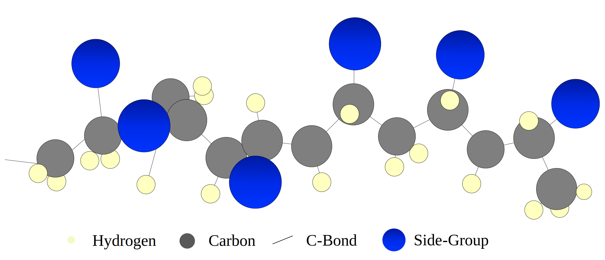
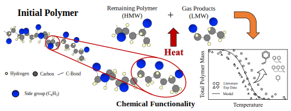

# Polymers-Kinetic-Mechanisms

Condensed-phase polymer degradation kinetic Mechanisms. Evaluation of gas-phase
pyrolytic and gasification reactivity are underway at CRECK modelling POLIMI.
The present repository is the polymer pyrolysis subset of the comprehensive one
on GitHub of [Creck Modeling Lab](https://github.com/CRECKMODELING/Kinetic-Mechanisms).
The mechanisms reported here are those employed and validated for my PhD Thesis (currently under writing).

The folders are organized by polymer type. In general semi-detailed, reduced, 
and skeletal mechanisms are available. Specifically:
- **Polyethylene** ([PE](PE): different models are available for HDPE and LDPE
    according to the degree of detail involved in products and radicals description.
    For HDPE both [semi-detailed](PE/HDPE_semidetailed), [reduced](PE/HDPE_reduced) 
    and [skeletal](PE/HDPE_skeletal) versions are availble. The same holds for LDPE with
    the [semi-detailed](PE/LDPE_semidetailed), [reduced](PE/LDPE_reduced) and 
    [skeletal](PE/LDPE_skeletal) mechanisms are reported. Thermodynamics and transport
    have been assessed as well.
- **Polypropylene** ([PP](PP): has a [semi-detailed](PP/PP_semidetailed), [reduced](PP/PP_reduced)
    and [skeletal](PP/PP_skeletal) mechanism available as well. Thermodynamics and transport
    have been validated. The mechanism for APP has not been reported due to the lower importance
    of APP in general wastes.
- **Polystyrene** ([PS](PS): the proposed mechanisms account for all structural differences. 
    The [semi-detailed](PS/PS_semidetailed) mechanism and both a [reduced](PS/PS_reduced) 
    and [skeletal](PS/PS_skeletal) version are currently available with validated
    thermodynamic properties. 
- **Poly(vinyl chloride)** ([PVC](PVC): the proposed [mechanism](PVC) accounts for the pure polymer degradation.
- Currently underway are models for **PET, PA, PMMA, and PU** and condensed-phase interactions

For most mechanisms, some validation pictures are reported as well.

## Kinetic Mechanism Description
    
The aim of the proposed kinetic models is to reproduce the main features of the degradation
process at low computational cost. This refers to describing the characteristic
degradation times (mass-loss profiles), product distribution, and heat requirements.

The kinetic mechanism are of the semi-detailed or lumped kind employing a
functional group approach:
- Long polymer chains are described with functional groups characteristic of
    the polymer moieties (mid- and end-chain groups) recognized by the "P-" in
    their name
- Short chains, i.e. compounds of interest, are described with real species as
    C2H4, C15H30, etc

Thermochemistry has been validated for PE, PP, and PS.
Transport parameters are evaluated with a simplified approach based on critical
temperatures and pressures, see [Holley et al. (2009)](http://dx.doi.org/10.1016/j.proci.2008.05.067).
The present models cannot be directly coupled to the creck gas-phase mechanism, 
but further work is underway to assess the secondary gas-phase reactivity.

     

